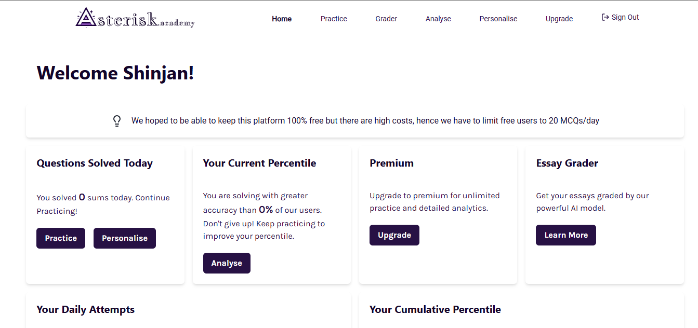
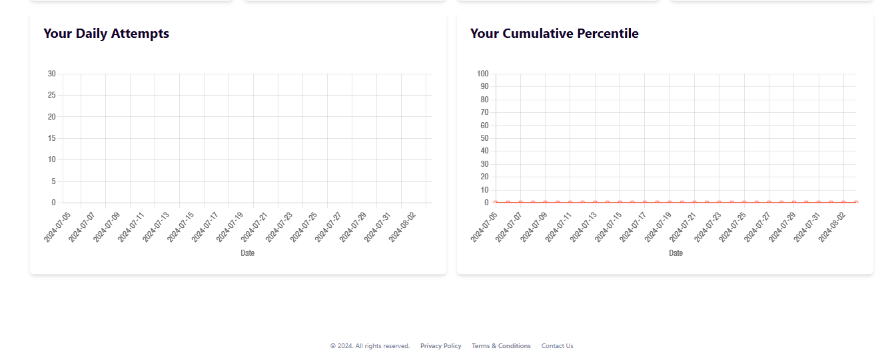
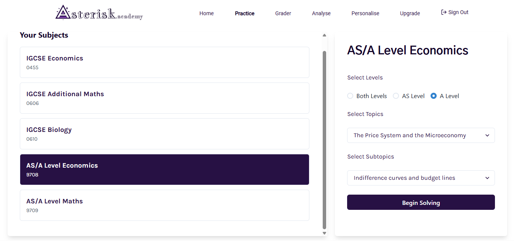
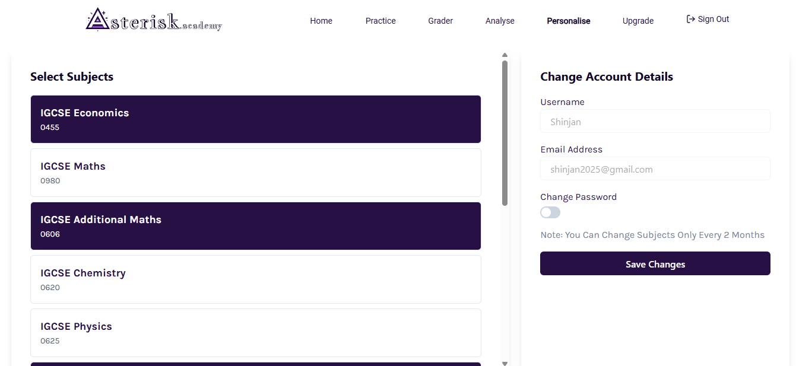

# Asterisk

An app to serve IGCSE & A Level MCQ Questions.

## Tech Stack

- MERN with NextJS (TypeScript)
- GPT 4o-mini model customed trained on the syllabus for MCQ Question generation
- GPT 4o-mini model custom trained on official grading principles for Essay Grading
- Chakra UI Libary for NextJS | For the Minimalistic Flat design desired
- ZOD for Client + Server Side Validation
- NextAuthJS, ResendEmail (custom email after domain purchase) for signin authentication and OTP Verification
- ReactEmail for formatting the email to be sent
- BcryptJS for password encryption and matching
- RazorPay Payment API
- React-Markdown, gfm and some more markdown formatters to format explanation and question strings

## Resources & Planned Features

- Paid Heroku/Hostinger/Digital Ocean Server + Hostinger domain + Free MongoDB database to store approx 10k-40k AI generated MCQs (with explanations, based on actual papers but not copying them, [CAIE Copyright](https://view.officeapps.live.com/op/view.aspx?src=https%3A%2F%2Fwww.cambridgeinternational.org%2FImages%2F114147-application-copyright-guidance.docx&wdOrigin=BROWSELINK) ). Approx storage consumed will be less than 100MB so will easily fit in the 512MB free plan.
- Questions will have default difficultyRatings based on their difficulty, to be adjusted dynamically after sufficient inputs. Users too will have a dynamic performance rating (userRating) per subject, which is basically their accuracy, based on which will be created their userRatingPercentile, which will be used to match with questionDifficultyPercentile for question serving purposes..
- Working on AI Auto Grader. Is being trained to generate questions with accurate difficulty ratings. It's going to use Unicode for math symbols and Markdown for text and graphics.
- RazorPay API integration, planning to restrict free users to 2 total subjects, 30 Practice Problems a day, and no AI Grader Access (have to see if this works accurately enough at all to be bothered after). Pricing would be $5/month, $12/3mo, $18/6mo, $30/yr for premium and $5/mo for AI Grader.

## Development in Progress

- Signup/Signin Authentication Completed
- All API routes and redirections set
- Created About, Signin/Signup, Dashboard, Personalise, Practice pages and their functionalities.
- asterisk.academy domain purchased.
- To Be Done: Grader page, Analyse Page, Upgrade Page and their functionalities.
- To Be Spent On: Open AI, RazorPay and Server.

### Dashboard

### Practice Page

### Personalise Page

