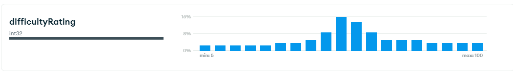
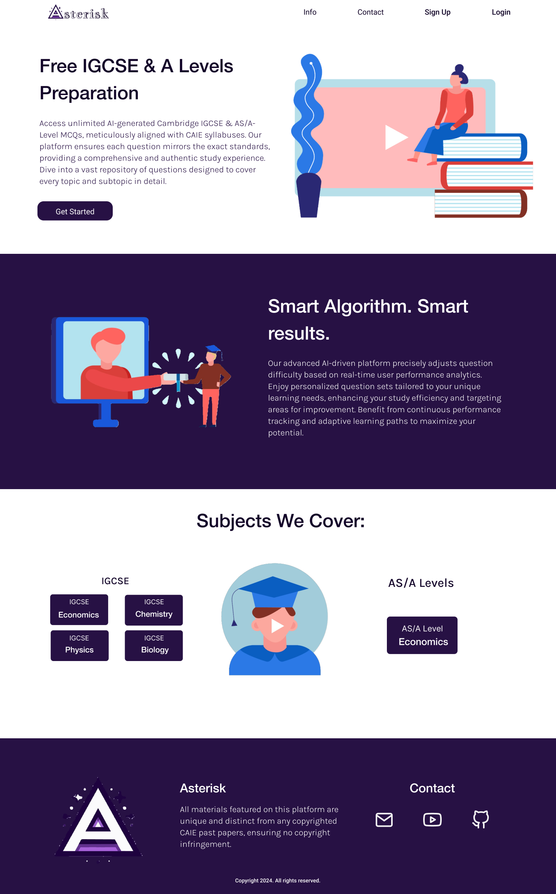
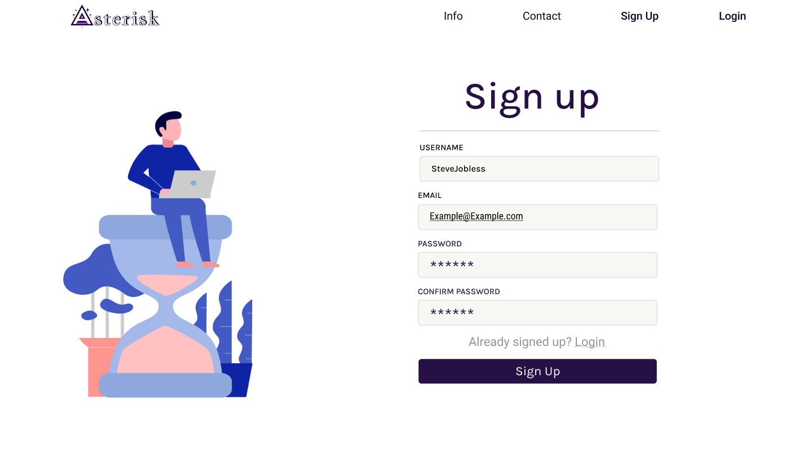
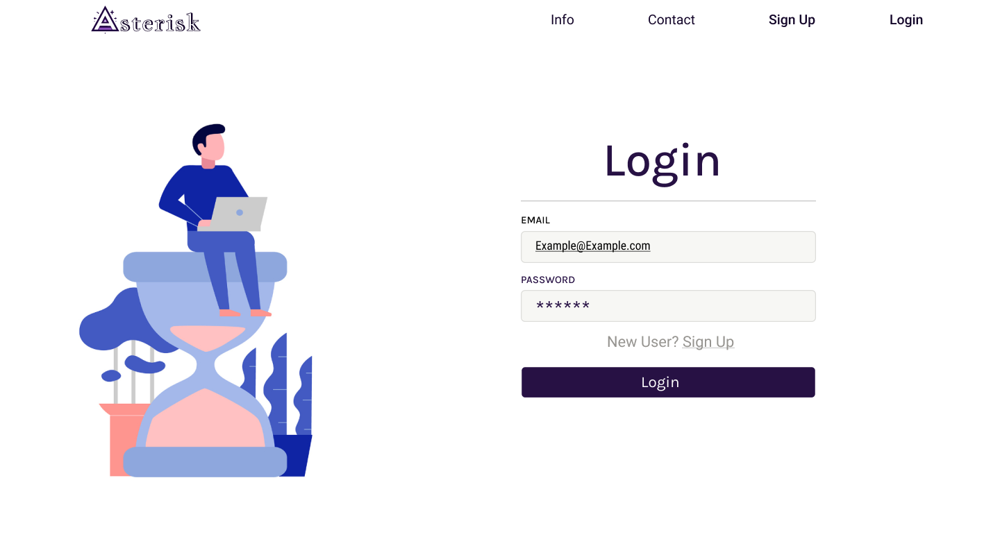
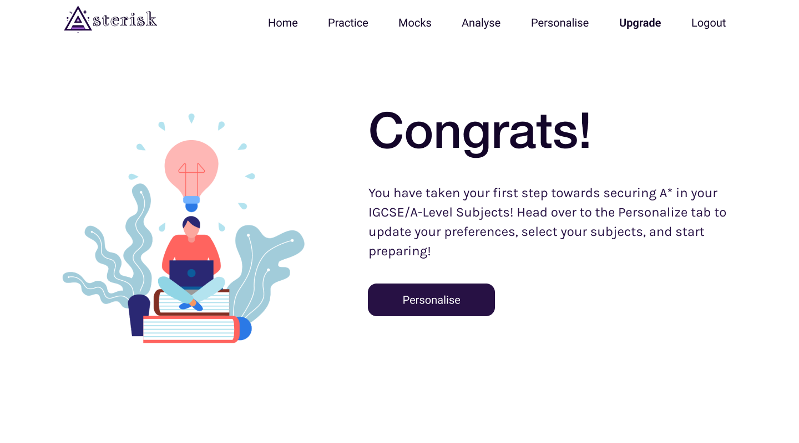

# Asterisk

An app to serve IGCSE & A Level MCQ Questions.

## Tech Stack

- MERN with NextJS (TypeScript)
- GPT 4o-mini model customed trained on the syllabus for MCQ Question generation
- GPT 4o-mini model custom trained on official grading principles for Essay Grading
- Chakra UI Libary for NextJS | For the Minimalistic Flat design desired
- ZOD for Client + Server Side Validation
- NextAuthJS, ResendEmail (custom email after domain purchase) for signin authentication and OTP Verification
- ReactEmail for formatting the email to be sent
- BcryptJS for password encryption and matching
- RazorPay Payment API
- React-Markdown, gfm and some more markdown formatters to format explanation and question strings

## Resources & Planned Features

- Paid Heroku Server + Namecheap domain + Free MongoDB database to store approx 10k AI generated MCQs (with explanations, based on actual papers but not copying them, [CAIE Copyright](https://view.officeapps.live.com/op/view.aspx?src=https%3A%2F%2Fwww.cambridgeinternational.org%2FImages%2F114147-application-copyright-guidance.docx&wdOrigin=BROWSELINK) ). Approx storage consumed will be less than 50MB so will easily fit in the 512MB free plan.
- Questions will have default difficultyRatings based on their difficulty, to be adjusted dynamically after sufficient inputs, with intial frequency distribution resembling a normal curve. Users too will have a dynamic performance rating (userRating) per subject, which is basically their accuracy, based on which will be created their userRatingPercentile, which will be used to match with questionDifficultyPercentile for question serving purposes..
- Small space to keep user accounts as well, estimated 50-100 free signups atleast after some Reddit self-promotion (can pay mods to pin the stuff for a week).
- Working on AI Auto Grader. Is being trained to generate questions with accurate difficulty ratings. It's going to use Unicode for math symbols and Markdown for other text.
- RazorPay API integration, planning to restrict free users to 2 total subjects, 30 Practice Problems a day, and no AI Grader Access (have to see if this works accurately enough at all to be bothered after). Pricing would be $5/month, $10/3mo, $15/6mo, $25/yr for premium and $5/mo for AI Grader.

## Development in Progress

- Signup/Signin Authentication Completed
- Most API routes and redirections set
- Database initialized on MongoDB with AS/A Level Economics Question Bank.
- Almost all API Routes set, with forgot password process requiring further debugging
- Created About, Signin Signup, Dashboard pages and their functionalities.

## Designing in Progress

### Landing

### Signup

### Login

### Welcome

